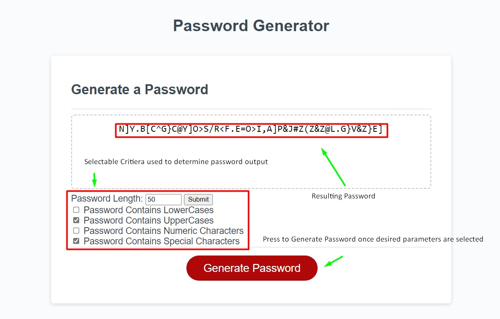

# <Challenge-3-Password-Generation>

## Description

With this challenge I greated a password generator using java script. I achieved this by implimenting button, checkmark, and number input html attributes, which subsequently allowed me to change the result of the password generated once selecting my desired criteria. For the actual generation of the password I used for loops, if statements, and functions to achieve my desired random number generation. From completing this assignment I learned the utility of math.random along with gaining a deeper understanding for for loops after trooblshooting several issues that persisted initally through my algorithm. 

## Installation

N/A

## Usage

Example on how to use Password Generator.

## Credits

Link to the github repository aswell as finished site link.

https://dummywoke.github.io/Challenge-3-Password-Generation/
https://github.com/DummyWoke/Challenge-3-Password-Generation

## License

MIT License

Copyright (c) 2022 DummyWoke

Permission is hereby granted, free of charge, to any person obtaining a copy
of this software and associated documentation files (the "Software"), to deal
in the Software without restriction, including without limitation the rights
to use, copy, modify, merge, publish, distribute, sublicense, and/or sell
copies of the Software, and to permit persons to whom the Software is
furnished to do so, subject to the following conditions:

The above copyright notice and this permission notice shall be included in all
copies or substantial portions of the Software.

THE SOFTWARE IS PROVIDED "AS IS", WITHOUT WARRANTY OF ANY KIND, EXPRESS OR
IMPLIED, INCLUDING BUT NOT LIMITED TO THE WARRANTIES OF MERCHANTABILITY,
FITNESS FOR A PARTICULAR PURPOSE AND NONINFRINGEMENT. IN NO EVENT SHALL THE
AUTHORS OR COPYRIGHT HOLDERS BE LIABLE FOR ANY CLAIM, DAMAGES OR OTHER
LIABILITY, WHETHER IN AN ACTION OF CONTRACT, TORT OR OTHERWISE, ARISING FROM,
OUT OF OR IN CONNECTION WITH THE SOFTWARE OR THE USE OR OTHER DEALINGS IN THE
SOFTWARE.

## Badges

N/A

## Features

Password Generation through the use of selectable properties such as length, Case sensitivity, and Symbol use.

## How to Contribute

N/A
